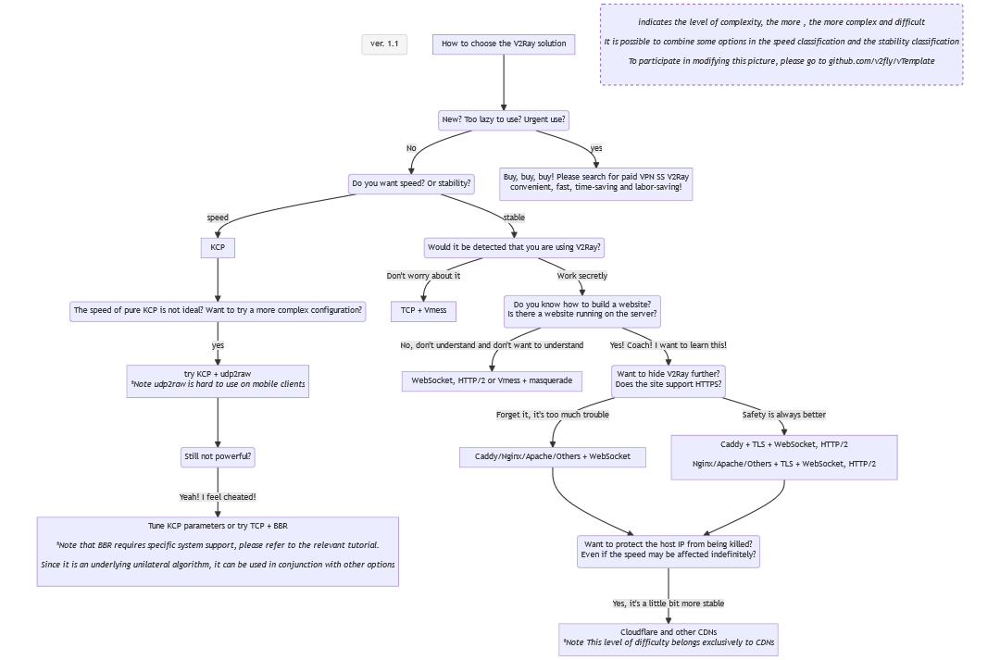

#v2ray-examples

Here are some V2Ray configuration examples for reference, the content keeps pace with the times, automation scripts, etc. Please do not pull the configuration from here.

Thanks to KiriKira, the author of vTemplate, Yuluowusheng and all the developers of Project V.

## Contribution Guidelines

You are welcome to make a template for your own configuration and submit a PR.

Templates should adhere to the following standards:
- use 4 spaces for indentation
- Square (curly) brackets do not wrap
- Unneeded fields should be removed
- `log` section only leaves `loglevel`
- For `outbounds`, client side should have `proxy` and `direct`, server side should have `direct` and `block`
- Unless it is a template for a specific scenario, `geoip:private` should be routed to `direct` outbound (server configuration routes to `block` outbound)
- DNS should not appear in config files unless it is a template for a specific scenario
- `uuid` should be left blank and filled by the user.
- `domainStrategy` in `routing` remains the default, which is `AsIs`.

### Examples

<!-- Here yaml is only used for syntax highlighting, the actual content is json -->
```yaml
{
    "log": {
        "loglevel": "warning"
    },
    "routing": {},
    "inbounds": [],
    "outbounds": []
}
```

### client

<!-- Here yaml is only used for syntax highlighting, the actual content is json -->
```yaml
{
    "log": {
        "loglevel": "warning"
    },
    "routing": {
        "domainStrategy": "AsIs",
        "rules": [
            {
                "ip": [
                    "geoip:private"
                ],
                "outboundTag": "direct",
                "type": "field"
            }
        ]
    },
    "inbounds": [
        {
            "port": 1080,
            "protocol": "socks",
            "settings": {
                "auth": "noauth",
                "udp": true
            },
            "tag": "socks"
        }
    ],
    "outbounds": [
        {
            "protocol": "vmess",
            "settings": {
                "vnext": [
                    {
                        "users": [
                            {
                                "id": ""
                            }
                        ],
                        "port": 1234,
                        "address": "Your_IP_Address"
                    }
                ]
            }
        },
        {
            "protocol": "freedom",
            "tag": "direct"
        }
    ]
}
```

### Server

<!-- Here yaml is only used for syntax highlighting, the actual content is json -->
```yaml
{
    "log": {
        "loglevel": "warning"
    },
    "routing": {
        "domainStrategy": "AsIs",
        "rules": [
            {
                "ip": [
                    "geoip:private"
                ],
                "outboundTag": "blocked",
                "type": "field"
            }
        ]
    },
    "inbounds": [
        {
            "port": 1234,
            "protocol": "vmess",
            "settings": {
                "clients": [
                    {
                        "id": "",
                    }
                ]
            }
        }
    ],
    "outbounds": [
        {
            "protocol": "freedom"
        },
        {
            "protocol": "blackhole",
            "tag": "blocked"
        }
    ]
}
```

## How to choose the configuration that suits you:



Additional Notes:<br>
Although Websocket+TLS+Web may be regarded as the best solution at this stage, it is definitely not a solution recommended for novices to try as soon as they come up, let alone the only usage of V2Ray. <br>
At the same time, you should understand that the network conditions in each region are different (mainly referring to the QoS level of different protocols), you can try all the configurations to find the most suitable one for you, try to ask as little as possible, and it is best not to ask "why do I V2Ray so slow?" Questions like that.

## at last

have fun!
