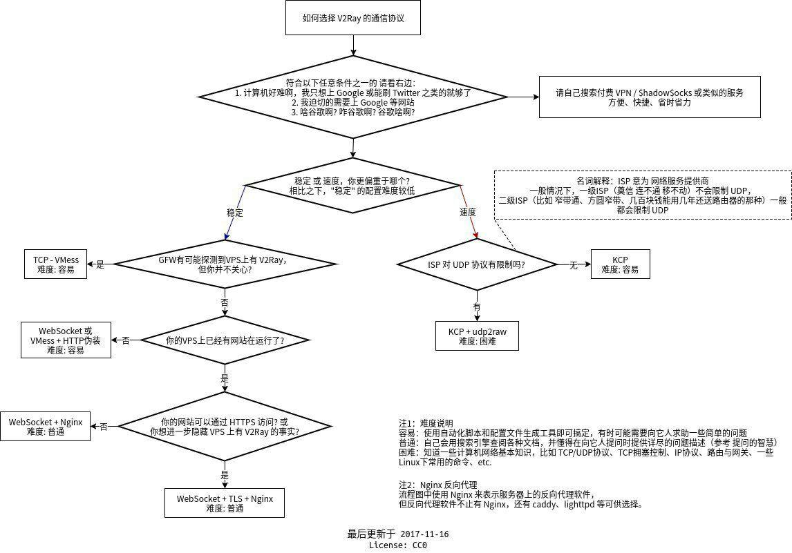

# vTemplate

## 这是一个社会实验性质的项目，提供数种常见的v2ray配置模板

这两天雨落无声大佬的[v2ray.fun](https://github.com/FunctionClub/v2ray.fun)宣布弃坑，再次引发了v2ray水群里大佬关于一键脚本和伸手党的讨论。在讨论过程中，提出了一个有趣的命题：

一键脚本是否会助长伸手之风？如果会，我们不提供一键脚本而只提供模板的话，情况是否又会好些？

于是，这个项目就诞生了。在这里收录一些常用的v2ray配置模板，这些配置多由v2ray.fun生成，在这基础上加上少许改动。 
在你套用模板之前，请先仔细阅读v2ray官方文档，如果可能，尽量尝试不借助模板自己编写配置文件，以加深对配置的理解。

如果你在配置过程中遇到问题，请再看一遍文档，或是在Google搜索以求自己解决问题。当你确认你的问题无法独立解决时，你可以在v2ray的telegram群组里求助，或是在v2ray官方项目中提交issue。 
遇事不决，请RTFM/STFW。 

**如何选取适合自己的配置**：

附加说明： 
尽管websocket+TLS+Web可能称得上是现阶段最好的方案，但**绝对**不是推荐新手一上来就尝试的方案，更不是V2Ray唯一的用法。 
同时，你应当了解，每个地区的网络状况不同(主要指对不同协议的QoS程度)，你可以将所有配置都尝试一遍来寻找最适合自己的，尽量少问、最好不问"为什么我的V2Ray这么慢？"这样的问题。

玩的愉快。

感谢Project V的所有开发人员，以及v2ray.fun的作者雨落无声。
