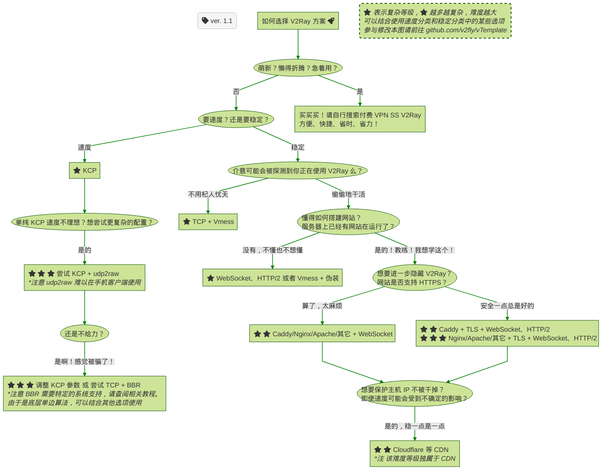

# 如何选择 V2Ray 方案



## 想参与修改本图？

1. 修改 [how-to-choose-a-v2ray-plan](how-to-choose-a-v2ray-plan.mmd) （参见 [Mermaid 流程图语法](https://mermaidjs.github.io/how-to-choose-a-v2ray-plan.html)）
1. 生成出 PNG 并覆盖已存在的 `how-to-choose-a-v2ray-plan.png` 文件
   1. 安装 [mermaid.cli](https://github.com/mermaidjs/mermaid.cli)
      ```shell
      # yarn config set puppeteer_download_host https://npm.taobao.org/mirrors
      yarn add mermaid.cli
      ```
      Or use NPM:
      ```
      # npm config set puppeteer_download_host=https://npm.taobao.org/mirrors
      npm install mermaid.cli
      ```
   1. 生成文件
      ```shell
      ./node_modules/.bin/mmdc -i how-to-choose-a-v2ray-plan.mmd -o how-to-choose-a-v2ray-plan.png -t forest -w 1920 -H 1080 -p puppeteer-config.json
      ```
1. 提交 PR

## 相关链接

[在线预览 Mermaid](https://mermaidjs.github.io/mermaid-live-editor/)  
[支持 Mermaid 的在线 Markdown 编辑器](https://mdp.tylingsoft.com/)  
[mermaid](https://github.com/knsv/mermaid)  
